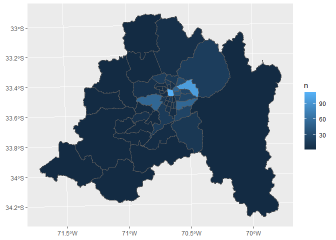
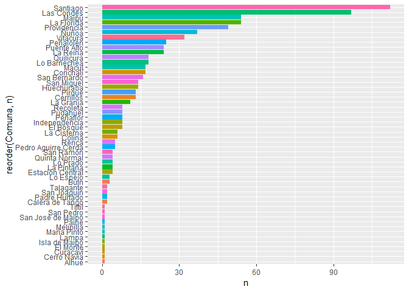

ejemplo1\_spatialjoin.R
================
Daniel
2020-08-05

title: “Entrenando vectores” author: “SO y DU” output: github\_document
Pasos

``` r
# 1. Leer puntos como tabla y convertir a formato espacial
# 2. Atributar los puntos con su comuna correspondiente (spatial join)
# 3. Generar estadísticas
```

Cargar librerías

``` r
library(sf)
library(ggplot2)
library(tidyverse)
```

Cargar datos con sf

``` r
tabla <- read_csv("data/reciclaje.csv")
```

    ## Parsed with column specification:
    ## cols(
    ##   Institucio = col_logical(),
    ##   Campana = col_character(),
    ##   Ubicacion = col_character(),
    ##   Direccion = col_character(),
    ##   lon = col_double(),
    ##   lat = col_double()
    ## )

``` r
reciclaje <- st_as_sf(tabla, coords = c("lon", "lat"), crs = 4326)

comunas <- read_sf("data/comunas.shp") %>% 
  filter(Region == "Región Metropolitana de Santiago")
```

Corroborar CRS

``` r
st_crs(reciclaje)$epsg
```

    ## [1] 4326

``` r
st_crs(comunas)$epsg
```

    ## [1] 3857

``` r
reciclaje_utm <- st_transform(reciclaje, crs = 32719)
comunas_utm <- st_transform(comunas, crs = 32719)
```

Hacer spatial join y estadísticas

``` r
reciclaje_comuna <- comunas_utm %>% 
  st_join(reciclaje_utm) %>% 
  group_by(Comuna) %>% 
  summarise( n = n())
```

Hacer gráfico Espacial

``` r
ggplot(reciclaje_comuna) +
  geom_sf(aes(fill=n))
```

<!-- -->

No Espacial

``` r
tab_rec_com <- st_drop_geometry(reciclaje_comuna)

ggplot(reciclaje_comuna, aes(x=reorder(Comuna, n), y = n, fill = Comuna)) +
  geom_col() +
  theme(legend.position = "none") +
  coord_flip()
```

<!-- -->

Para revisarlo en Excel

``` r
write_csv(tab_rec_com, "tabla.csv")
```
